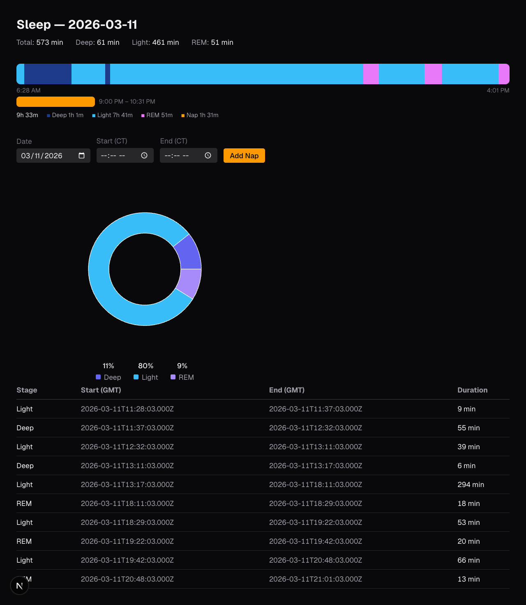

# fitness-dash

> **Work in progress.** Actively being built.

A personal fitness dashboard for Garmin data. The goal is simple, usable sleep (and eventually activity) data that's actually better than what the fitness apps give you — with full control to add, edit, and delete records, including naps that Garmin misses entirely.

Garmin Connect's sleep view is fine for a glance, but it doesn't let you correct bad data, log naps, or compare nights side by side in a way that's actually readable. This fixes that.



## Current focus: sleep

- **Sleep timeline** — horizontal bar showing each stage (Deep, Light, REM, Awake) proportionally across the night. Hover any segment for the exact time range.
- **Sleep pie chart** — donut chart breaking down stage totals for the night.
- **Nap tracking** — manually log naps Garmin misses. Naps appear as separate bars adjacent to the main sleep bar.
- **Raw stage table** — full list of every sleep stage record for the selected night.

## Planned

- Edit and delete individual sleep stage records
- Multi-night comparison view (scroll through recent nights as stacked bars)
- Activity data — workouts, heart rate, HRV trends

## Data

Sleep data lives in `data/garmin.db` (SQLite). The `sleep_stages` table has one row per stage segment:

```
date TEXT, start_gmt INTEGER, end_gmt INTEGER, stage INTEGER
```

Stage values: `-1` Unmeasurable · `0` Deep · `1` Light · `2` REM · `3` Awake

Timestamps are Unix milliseconds in UTC. All display times are converted to `America/Chicago`.

Naps are stored in a separate `naps` table in the same database (created by `scripts/migrate-naps.ts`).

## Data Pipeline

The dashboard reads from a local SQLite file. Getting data into it is a two-step process.

### 1. Fetch from Garmin Connect API

Uses the [`garminconnect`](https://github.com/cyberjunky/python-garmin-connect) Python library. Credentials go in a `.env` file in the project root:

```
GARMIN_EMAIL=you@example.com
GARMIN_PASSWORD=yourpassword
```

Set up the Python environment once:

```bash
python3 -m venv .venv
.venv/bin/pip install garminconnect python-dotenv
```

Then fetch:

```bash
# Sleep data — incremental, safe to re-run (skips already-fetched dates)
.venv/bin/python scripts/fetch_sleep.py

# Activities — full refresh every run
.venv/bin/python scripts/fetch_activities.py
```

Both scripts save the full raw API responses to `data/sleep.json` and `data/activities.json` — nothing is parsed or stripped.

### 2. Import into SQLite

```bash
npx tsx scripts/import.ts
```

Reads `data/sleep.json` and writes one row per sleep stage segment into `sleep_stages`. Uses `INSERT OR IGNORE` so it's safe to re-run — only new records are added.

To create the naps table (first time only):

```bash
npx tsx scripts/migrate-naps.ts
```

### Typical refresh flow

```bash
.venv/bin/python scripts/fetch_sleep.py   # pull new nights from Garmin
npx tsx scripts/import.ts                 # load them into SQLite
```

Then reload the dashboard — it always queries the latest date in the database.

## Stack

- **Next.js** (App Router) — server components query SQLite directly, no API layer needed
- **better-sqlite3** — synchronous SQLite reads in server components
- **Tailwind CSS** — dark theme throughout
- **recharts** — pie/donut chart

## Getting Started

```bash
npm install
npm run dev
```

Place your `garmin.db` in `data/`, then run the nap migration if you haven't:

```bash
npx tsx scripts/migrate-naps.ts
```
